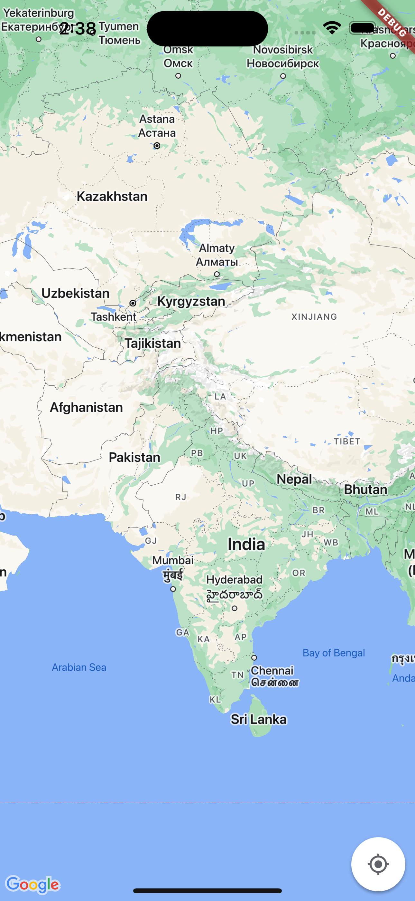
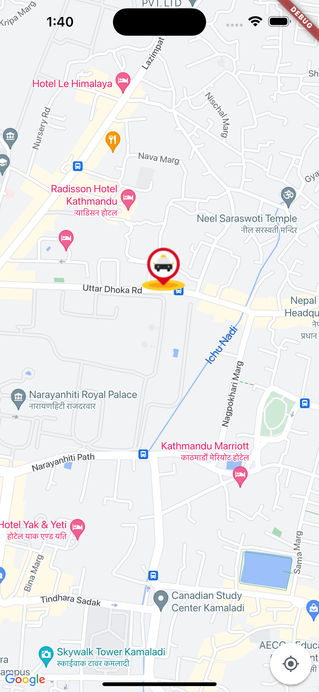
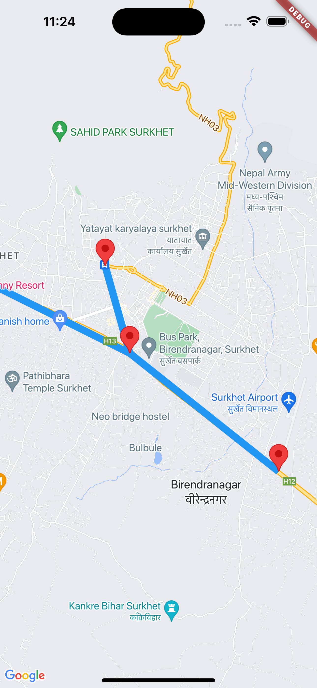
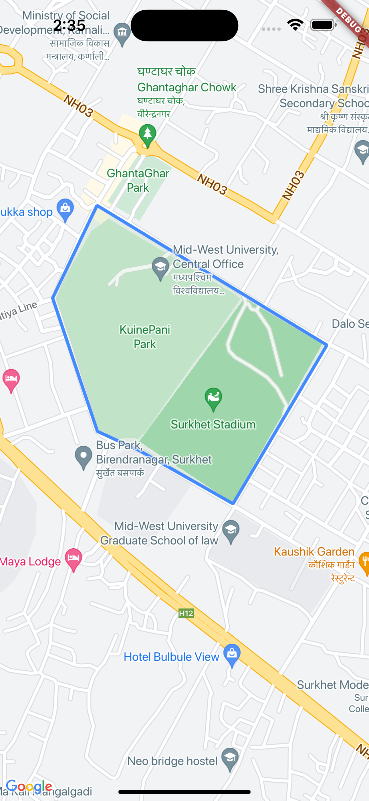
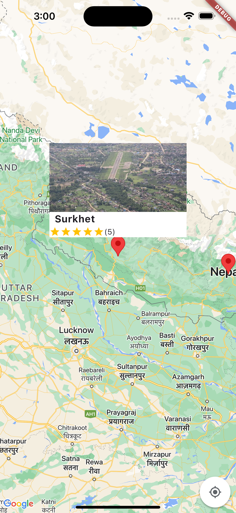

# Complete Source Code
Google Map: https://buymeacoffee.com/wtfcode/e/384971

# Google Map Feature
You'll learn how to integrate Google Maps into your Flutter app. We'll cover:

✅ Displaying Google Maps
✅ Getting the user's current location
✅ Adding custom markers and info windows
✅ Drawing polygons and polylines on the map
✅ Using the Google Maps API in Flutter

By the end of this tutorial, you'll have a fully functional map integration, perfect for location-based apps. Whether you're a beginner or an experienced developer, this guide will help you get started with Flutter Google Maps step by step! 🚀

## Screenshot

      

